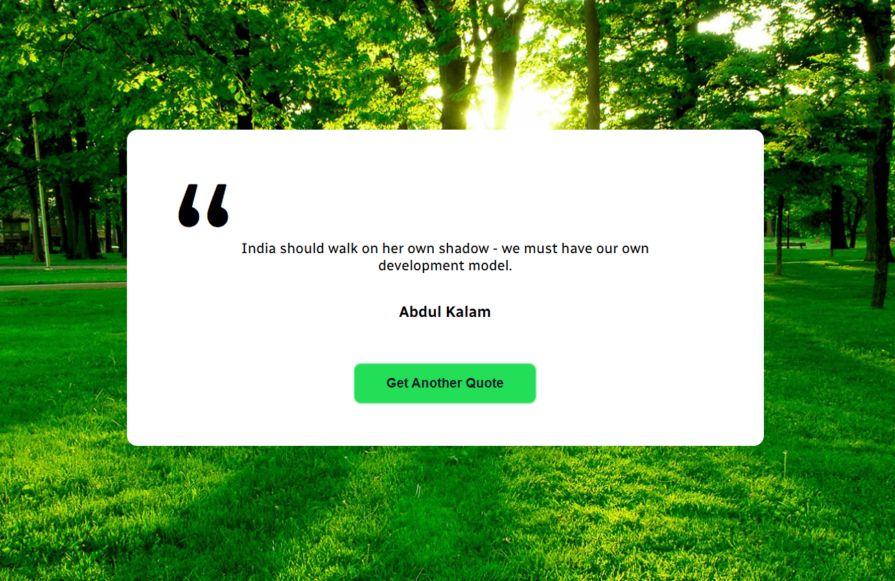

---

# Random Quote Generator

This is a simple Random Quote Generator built using **HTML**, **CSS**, and **JavaScript**. Users can click a button to generate a new random quote displayed on the screen.

## Features

- **Simple UI**: Clean and minimal design.
- **Generate Random Quotes**: Click the button to get a new quote.

## Tech Stack

- **HTML**: Structure of the application.
- **CSS**: Styling for an intuitive and minimal design.
- **JavaScript**: Handles task management and interactions.

## Deployment

This web app is deployed using [Vercel](https://vercel.com/) by Tiger. You can access the live version here: [Random Quote Generator](https://random-quote-generator-one-mu.vercel.app/)

## ScreenShots

## Getting Started

To run the app locally:

1. Clone this repository.
2. Navigate to the project folder.
3. Open `index.html` in your browser.

## License

This project is licensed under the MIT License - see the [LICENSE](LICENSE) file for details.

## Author

Made with ❤️ by Tiger

---